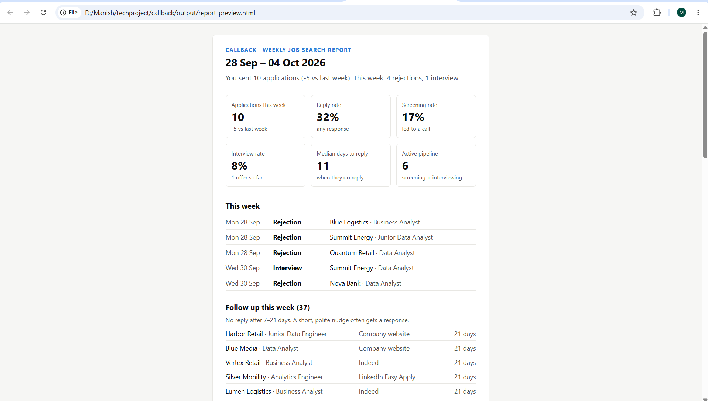

# Callback

**An automated weekly report on my job search.** Every Monday at 9 am, Callback reads my application tracker, checks it for mistakes, calculates funnel metrics, and emails me a report with charts and a list of applications to follow up on.



> The repository runs on **realistic sample data** (fictional companies), so it can be published without exposing a real job search. Drop a real tracker in `data/applications.xlsx` and Callback switches to it automatically.

---

## What the email answers

| Question | How |
|---|---|
| Am I keeping up my pace? | Applications this week vs last week, 8-week trend |
| Is it working? | Reply rate, screening rate, interview rate, median days to reply |
| Where does it break down? | Funnel: applied → screening → interview → offer |
| Which channels are worth my time? | Screening rate per source, with small-sample warnings |
| What should I do this week? | Follow-up list (7–21 days, no reply) and applications that just went silent |
| Is my tracker clean? | Tracker health: auto-fixed issues and ones needing attention |

---

## How it works

```
data/applications.xlsx
        │  tracker.py     load, clean, validate (fix / warn / exclude)
        ▼
clean DataFrame + issue log
        │  metrics.py     status, timings, funnel, sources, trend, actions
        ▼
metrics
        │  charts.py      3 PNG charts (matplotlib)
        │  report.py      HTML email from a Jinja2 template
        ▼
send_email.py → Gmail (SMTP over SSL, charts embedded inline)
        ▲
main.py  ←  run_callback.bat  ←  Windows Task Scheduler (Mondays 09:00)
```

---

## Design decisions

- **Record events, not a status.** The tracker stores the *date* of each stage (applied, screening, interview, offer, rejected). Status is derived, so it's never contradictory, and time-to-reply can be measured.
- **Maturity window.** Reply and interview rates only count applications at least 14 days old. Otherwise last week's applications, which haven't had time to get answers, would drag the rates down.
- **Validate, don't silently fix.** Safe problems (spacing, capitalisation, duplicates) are fixed and logged; questionable ones (a screening call dated before applying) are flagged; unusable rows are excluded. Every action appears in the email's *Tracker health* section.
- **Reply rate ≠ screening rate.** Company websites reply often, but mostly with rejections; recruiters reply less often, but usually with a call. Tracking both avoids a misleading picture.
- **Secrets stay out of code.** Gmail credentials live in a git-ignored `.env` file (an App Password, never the account password).
- **Pure, tested functions.** Metrics have no side effects, and a pytest suite covers the status rules, the report week, the maturity window and the validator.
- **Built to run unattended.** File logging, a non-interactive chart backend, a non-zero exit code on failure, and retries in Task Scheduler.

---

## Run it yourself

```bash
git clone https://github.com/kmanishgoud/callback.git
cd callback
python -m venv .venv
.venv\Scripts\activate            # Windows  (Mac/Linux: source .venv/bin/activate)
pip install -r requirements.txt
```

```bash
python src/main.py --dry-run --preview   # build the report from sample data and open it
python -m pytest -v                      # run the tests
```

**To email it:** create a [Gmail App Password](https://myaccount.google.com/apppasswords), copy `.env.example` to `.env`, fill it in, then run `python src/main.py`.

**To schedule it (Windows):** create a weekly task in Task Scheduler that runs `run_callback.bat`.

**To use your own data:** save the sample tracker as `data/applications.xlsx`, clear the rows, and add your applications.

---

## Project structure

```
callback/
├── data/sample/              # sample tracker (real tracker is git-ignored)
├── src/
│   ├── config.py             # paths, allowed values, thresholds
│   ├── generate_sample.py    # realistic sample data (with deliberate typos)
│   ├── tracker.py            # load + validate
│   ├── metrics.py            # all calculations
│   ├── charts.py             # PNG charts
│   ├── report.py             # HTML rendering
│   ├── send_email.py         # Gmail SMTP
│   └── main.py               # pipeline entry point
├── templates/report.html.j2  # email template
├── tests/                    # pytest suite
├── run_callback.bat          # Task Scheduler launcher
└── .env.example              # settings template (no secrets)
```

**Tools:** Python · pandas · matplotlib · Jinja2 · smtplib · pytest · python-dotenv · Windows Task Scheduler